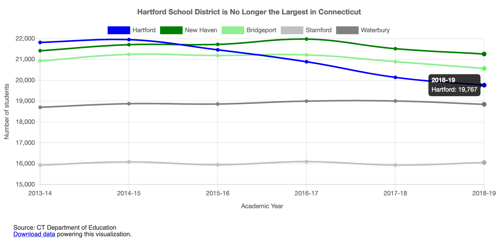

# Line Chart with 1 or More Series



In `data.csv`, each row is a point in time (x-axis). Each column is a new series.
There can be any number of points in time (rows) and any number of series (columns).

The first column is always labels for the x-axis. Second and all other
columns are new series (lines), whose label is taken from the first row (header).

In `script.js`, you can customize the values of variables shown in the code snippet below. For more customization, see [Chart.js documentation](https://www.chartjs.org/docs/latest/).

```javascript
var TITLE = 'Hartford School District is No Longer the Largest in Connecticut';

var X_AXIS = 'Academic Year';  // x-axis label and label in tooltip
var Y_AXIS = 'Number of Students'; // y-axis label and label in tooltip

var BEGIN_AT_ZERO = false;  // Should x-axis start from 0? `true` or `false`

var SHOW_GRID = true; // `true` to show the grid, `false` to hide
var SHOW_LEGEND = true; // `true` to show the legend, `false` to hide
```

## See also
See **Line Chart with CSV Data** chapter in DataVizForAll: https://datavizforall.org/line-chart-with-csv-data.html